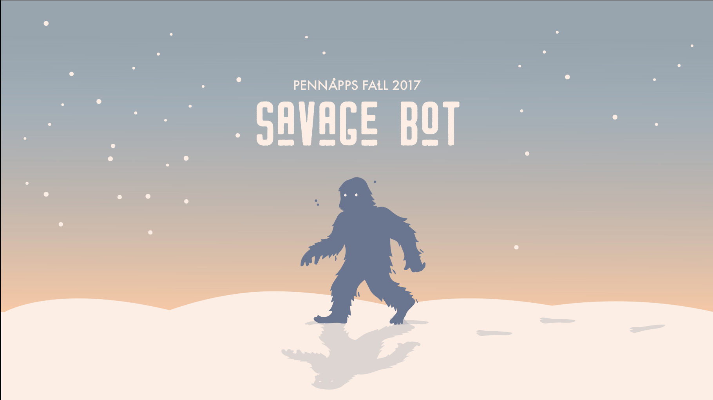

# Savage Bot

## Inspiration

"Savage," by the definition of Urban Dictionary, means to humorously mock or humiliate someone with a well-timed joke, diss or comeback. We wanted to build a bot that will automatically savage (or roast) you, either because you feel like you deserve it, or simply because you needed a little alternate fun in your otherwise boring life.

## What it does

It is a very simple hack. You enter a sentence into Savage Bot, and it will respond you with a little bit of roast (hopefully just a little, not too much).

## How we built it

We first retrieved posts and comments from Reddit, more specifically a subreddit called "RoastMe." By making use of how commentators respond to a tag line or a picture, we tried to use machine learning to train a chatbot. However, the training time would take at least 2 days, and we decided that it was out of the scope of the given time span, so we reverted to a search instead. Once you enter a sentence, google cloud would retrieve key words of the sentence, and our backend would find a comment that best matches the sentence you entered. 

## Challenges we ran into

Seemed easy, but actually not. The Reddit dataset is huge - speaking of 250+ GB worth of data. We used Google Big Query to do processing, but it was still a considerable amount of time. We invested a lot of time earlier in ML model before we decided that it didn't go where we wanted it to be. The rest of the hack was hurried off under our sleep deprivation.  

## Accomplishments that we're proud of

It was a fun hack! We wanted to enjoy (possibly) our last hackathon in our college life.

## What's next for Savage Bot (Roasting Party)

We registered for a domain name **roastingparty.com**, as we felt like it would be a matching name with our Savage Bot. We'll try to see if we can host it in the future, just because... why not?
